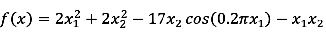
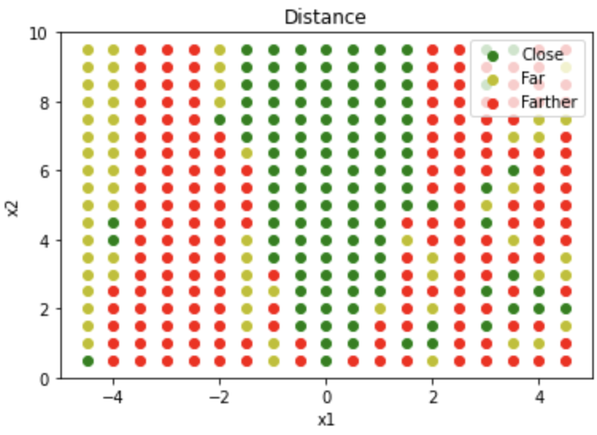
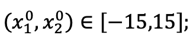

# Local Minimum Optimization Using Genetic Algorithms
This project explores using both Newton's method and genetic algorithms to find local minima of a given function.

We are given the following function:




## Newton's Method:
Using Newton's method, starting from the points (1, 3), we find the minimum of the given function. Additionally, for all points where 0 < x1 < 5, -5 < x2 < 10 with steps of 0.5, we determine the minimum value:

The function:
```python
def function (x1, x2):
    f = (2 * (x1 ** 2)) + (2 * (x2 ** 2)) - (17 * x2 * np.cos(0.2 * np.pi * x1)) - (x1 * x2)
    return f

def gradient_calc (x1, x2):
    dx1 = (4 * x1) - x2 + (3.4 * np.pi * x2 * np.sin(0.2 * np.pi * x1))
    dx2 = (4 * x2) - x1 - (17 * np.cos(0.2 * np.pi * x1))
    gradient = np.array([[dx1],[dx2]])
    return gradient

def Hessian_calc (x1, x2):
    d2x1 = (4) + (0.68 * (np.pi ** 2) * x2 * np.cos(0.2 * np.pi * x1))
    dx1dx2 = -1 + (3.4 * np.pi * np.sin(0.2 * np.pi * x1))
    dx2dx1 = -1 + (3.4 * np.pi * np.sin(0.2 * np.pi * x1))
    d2x2 = 4
    Hessian = np.array(([d2x1, dx1dx2],[dx2dx1, d2x2]),dtype='float')
    return Hessian

def find_local_min (x1, x2, num_epochs):
    function_values = []
    x = np.array([[x1],[x2]])
    for i in range(num_epochs):
        Hessian_Inv = np.linalg.inv(Hessian_calc(x1, x2))
        gradient = gradient_calc(x1, x2)
        x = x - np.dot(Hessian_Inv, gradient)
        x1 = x[0][0]
        x2 = x[1][0]
        function_values.append(function(x1,x2))
    return min(function_values)
```

We ge the min as below:

```
local minimum of the function:  -36.40349774185023
```

We categorize these points into three groups based on their distance from -36.4: close, far, and farther. We, plot these points as below:



## Genetic Algorithm:

Using the genetic algorithm method, we find the local minimum of the function under the following condition:



First, we define the objective function as below:

```python
def objective (x):
	x1 = x[0]
	x2 = x[1]
	f = (2 * (x1 ** 2)) + (2 * (x2 ** 2)) - (17 * x2 * np.cos(0.2 * np.pi * x1)) - (x1 * x2)
	return f
```

Then, the selection, crossover, and mutation steps are defined in seperate functions as below:

The selection procedure takes the population and returns one selected parent:

```python
def selection(pop, scores, k=3):
	random_selection = randint(len(pop))
	for individual in randint(0, len(pop), k-1):
		if scores[individual] < scores[random_selection]:
			random_selection = individual
	return pop[random_selection]
```

The crossover function uses crossover_rate to determine if crossover is performed, then selecting a valid split point if crossover is to be performed:

```python
def crossover(parent1, parent2, crossover_rate):
	child1, child2 = parent1.copy(), parent2.copy()
	if rand() < crossover_rate:
		crossover_point = randint(1, len(parent1)-2)
		child1 = parent1[:crossover_point] + parent2[crossover_point:]
		child2 = parent2[:crossover_point] + parent1[crossover_point:]
	return [child1, child2]
```

The mutation procedure simply flips bits with a low probability controlled by the mutation_rate:

```python
def mutation(bitstring, mutation_rate):
	for i in range(len(bitstring)):
		if rand() < mutation_rate:
			bitstring[i] = 1 - bitstring[i]
```

Then, we decode the bitstrings to numbers prior to evaluating each with the objective function.

First, I take the bounds of the function, the number of bits per variable, and a bitstring as input.
Then, I decode each substring to an integer, scale the integer to the desired range, and return a list of decoded real values.


Finally, the genetic algorithm function is implemented as below:

```python
def genetic_algorithm(objective, bounds, n_bits, n_iter, population_size, crossover_rate, mutation_rate):
	population = [randint(0, 2, n_bits * len(bounds)).tolist() for _ in range(population_size)]
	best, best_eval = 0, objective(decode(bounds, n_bits, population[0]))

	for gen in range(n_iter):
		decoded = [decode(bounds, n_bits, individual) for individual in population]
		scores = [objective(d) for d in decoded]

		for individual in range(population_size):
			if scores[individual] < best_eval:
				best, best_eval = population[individual], scores[individual]
				print(">%d, new best f(%s) = %f" % (gen,  decoded[individual], scores[individual]))

		selected = [selection(population, scores) for _ in range(population_size)]

		children = list()
		for i in range(0, population_size, 2):
			parent1, parent2 = selected[i], selected[i+1]
			for child in crossover(parent1, parent2, crossover_rate):
				mutation(child, mutation_rate)
				children.append(child)

		population = children
	return [best, best_eval]
```

We define the initial parameters as following:

```python
# define range for input
bounds = [[-15.0, 15.0], [-15.0, 15.0]]

# bits per variable
n_bits = 16

# define the population size
n_pop = 100

# define the total iterations
n_iter = 100

# crossover rate
r_cross = 0.9

# mutation rate
r_mut = 1.0 / (float(n_bits) * len(bounds))
```

We also check the algorithm for different crossover and mutation rates and check the convergence.
